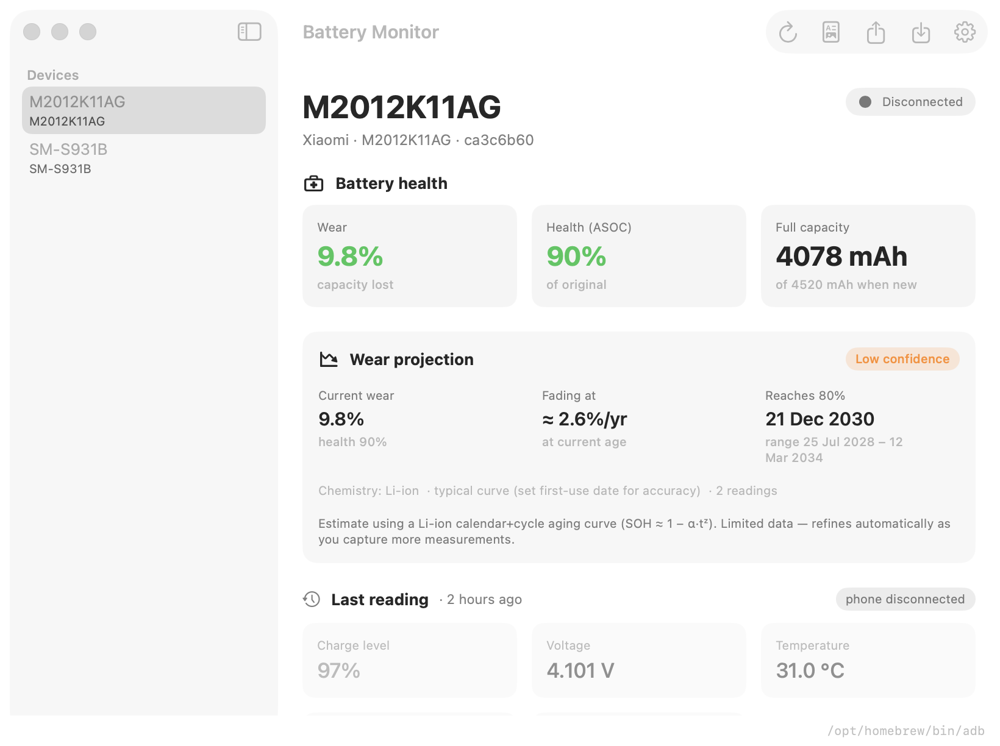
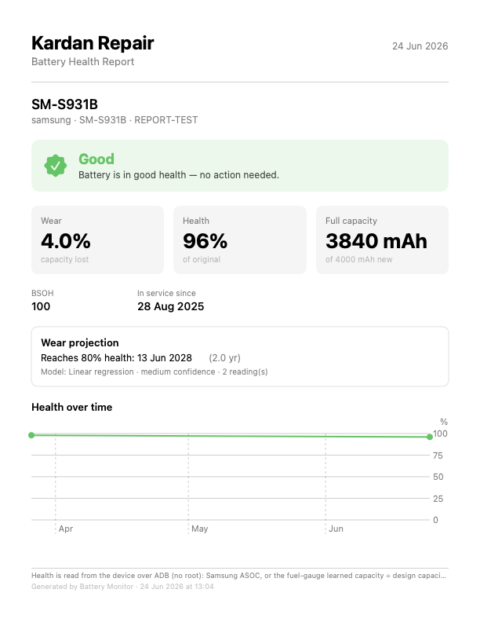
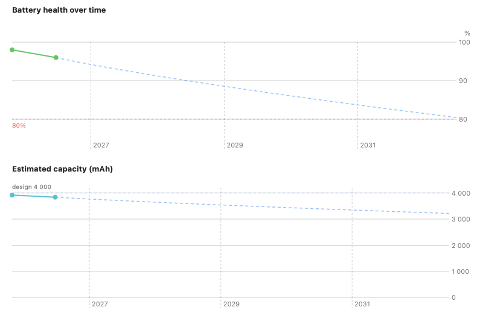

# Battery Monitor


A native macOS app that reads **Android phone battery health over ADB**, stores a local
history, **projects battery wear**, and exports a **customer-ready PDF report**.

It exists because many phones (e.g. the Samsung Galaxy S25 in several regions) **hide the
battery-health screen**, even though the data is sitting right there in `dumpsys battery`.
Plug the phone into a Mac and Battery Monitor surfaces it.

| App | Customer report |
|---|---|
|  |  |

Chemistry-aware wear projection (`SOH = 1 − α·tᶻ`) with a fixed-scale capacity chart and an 80% end-of-life line:



> Verified without root on a Galaxy S25 (SM-S931B) and a Poco F3 (M2012K11AG).
> See [`docs/samsung-battery-health-adb.md`](docs/samsung-battery-health-adb.md).

## Features

- **Live readout** — charge level, **health % (Samsung ASOC)**, estimated mAh vs. design
  capacity, BSOH bucket, temperature, voltage, charge counter.
- **Local history** — every reading stored on-device with SwiftData; charts of health and
  capacity over time (Swift Charts).
- **Guided connection** — a live step-by-step assistant (install adb → connect → enable
  USB debugging → authorize) that lights up as you go, plus a banner that surfaces the
  *“tap Allow on your phone”* prompt the instant a device shows as unauthorized.
- **Auto-capture** — a reading is taken automatically when a known phone is plugged in
  (USB hot-plug via IOKit), plus a manual **Capture** button.
- **Wear projection** — estimates the date your battery reaches an end-of-life threshold
  (default 80%). Works from a **single measurement** and gets more accurate, with a
  tightening confidence band, as measurements accumulate.
- **Customer PDF report** — one-page battery-health report (verdict, wear, capacity,
  projection, chart) with your shop name, ready to hand a customer.
- **Export / Import** — portable, versioned JSON. Move data between Macs or archive it.
- **Extensible** — adding a new phone family is one `BatteryProbe` conformer registered in
  `DeviceRegistry`; nothing else changes. Ships with Samsung + Xiaomi/Poco probes.

## Supported devices

| Vendor | Probe | Health source (no root) | Verified on |
|---|---|---|---|
| Samsung (One UI) | `SamsungProbe` | `dumpsys battery`: ASOC %, BSOH, first-use & cell dates | Galaxy S25 (SM-S931B) |
| Xiaomi / Redmi / Poco (MIUI/HyperOS) | `XiaomiProbe` | `dumpsys batterystats` learned capacity ÷ design | Poco F3 (M2012K11AG) |
| Any other Android | `GenericAOSPProbe` | sysfs `charge_full`, else batterystats learned capacity | — |

Charge **cycle count** is generally not exposed over ADB without root (Samsung & Xiaomi
both withhold it; Xiaomi’s is behind the `*#*#6485#*#` service screen). Health % is the
reliable wear metric regardless.

## Requirements

- macOS 14+
- [`adb`](https://developer.android.com/tools/adb) — install with:
  ```sh
  brew install android-platform-tools
  ```
  Battery Monitor auto-detects adb on `PATH`, in Homebrew locations, and in the Android
  SDK; you can also point it at a custom path in **Settings**.

## Enable USB debugging on the phone

1. **Settings → About phone → Software information** → tap **Build number** 7×.
2. **Settings → Developer options** → enable **USB debugging**.
3. Connect via USB, set the mode to **File transfer**, and tap **Allow** on the
   *“Allow USB debugging?”* prompt.

Full walkthrough and troubleshooting: [`docs/samsung-battery-health-adb.md`](docs/samsung-battery-health-adb.md).

## Build & run

Development (no Xcode project needed):

```sh
swift build          # build
swift test           # run the BatteryCore unit tests
swift run battery-monitor   # launch the GUI app (dev runner)
swift run bmprobe           # headless one-shot battery read
```

Distributable `.app` (code signing / notarization / app icon):

```sh
brew install xcodegen
xcodegen generate
open BatteryMonitor.xcodeproj
```

> The app runs the external `adb` executable, which the macOS App Sandbox forbids — so it
> ships **un-sandboxed**, signed with Developer ID and notarized (not via the Mac App
> Store). See `project.yml`.

## Releases

Build a `.app` + `.dmg` in one step:

```sh
brew install xcodegen
./scripts/build-release.sh 1.0        # → dist/BatteryMonitor-1.0.dmg
```

Then attach the DMG to a GitHub release:

```sh
gh release create v1.0 dist/BatteryMonitor-1.0.dmg --title "Battery Monitor 1.0"
```

> **Gatekeeper note:** the release build is *ad-hoc signed*, not notarized with a paid
> Apple Developer ID. macOS will warn on first launch. Users open it once via
> **right-click → Open** (or run `xattr -dr com.apple.quarantine /Applications/BatteryMonitor.app`).
> To ship without that friction, sign with a Developer ID certificate and notarize
> (`xcrun notarytool submit`), then `xcrun stapler staple`.

## Architecture

A pure-logic Swift package (`BatteryCore`, fully unit-tested, no UI) under a thin SwiftUI
app shell.

```
Sources/BatteryCore/
  Transport/   ADBClient (actor), AdbLocator, ADBError      — talk to adb
  Probe/       BatteryProbe + SamsungProbe + GenericAOSPProbe + DeviceRegistry
  Model/       DeviceIdentity, DeviceProfile, BatterySample, DesignCapacityCatalog
  Persistence/ SampleRepository, ExportDocument (versioned JSON)
  Analysis/    WearModel + LinearCalendar/LinearRegression/SqrtCalendar + WearEstimator
App/
  Store/       SwiftData entities + SwiftDataRepository
  ViewModels/  AppModel (@Observable orchestration)
  Views/       window, charts, wear panel, menu-bar, settings
  ConnectionMonitor (IOKit USB hot-plug)
```

Design notes: protocol-oriented with dependency injection; the UI-free core is fully
tested; subprocess access is actor-isolated and drains pipes concurrently to survive large
`dumpsys` output; probes and wear models are Strategy patterns dispatched by a registry;
storage is behind a Repository protocol; the export schema is versioned with a migration
hook.

### Adding a device family

`SamsungProbe` and `XiaomiProbe` show the pattern. To add another OEM:

1. Write `struct YourProbe: BatteryProbe` parsing that OEM's `dumpsys`/sysfs.
2. Add it to `DeviceRegistry.standard` before `GenericAOSPProbe`.
3. Add design capacities to `DesignCapacityCatalog`.

That's the entire change — UI, storage, and analysis are device-agnostic.

## How wear projection works

Each reading becomes a point `(ageDays, health%)`, aged from the battery's first-use date.

- **One reading** → linear calendar estimate (`health = 100 − rate·t`) → projected date to
  threshold. Flagged **low confidence**.
- **More readings** → the estimator also fits free linear regression and √t calendar aging
  (`health = 100 − a·√t`, the textbook Li-ion calendar-fade shape) and keeps the best fit
  by R². Confidence rises as the data spans more time. A calendar + cycle model is ready
  for OEMs that expose cycle count (the S25 does not over ADB).

## Roadmap

- **Android companion app** (later sprint) — *feasible*: on Android 14+, the public
  `BatteryManager` API exposes charge cycle count and capacity without root; it could log
  to the same JSON schema and import here. Health %, manufacture/first-use dates remain
  system-gated.
- Additional OEM-specific probes (Pixel, OnePlus) for richer per-vendor data.

## License

[MIT](LICENSE).
